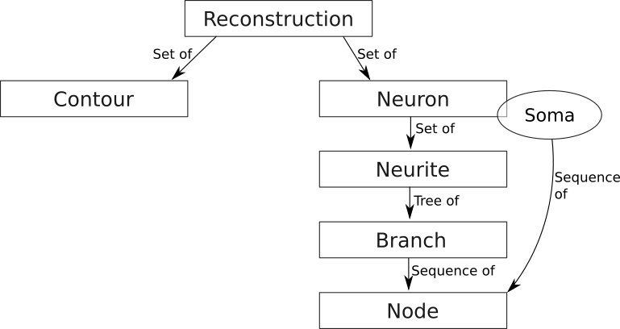
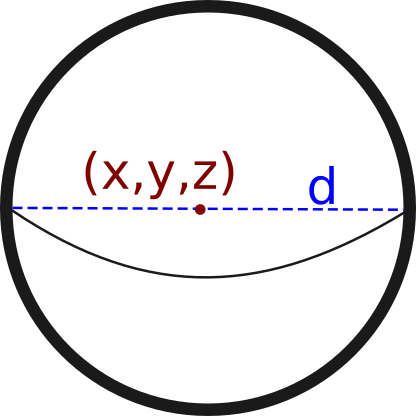
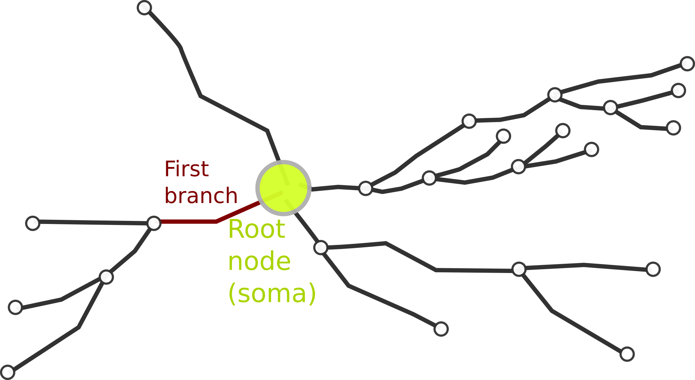
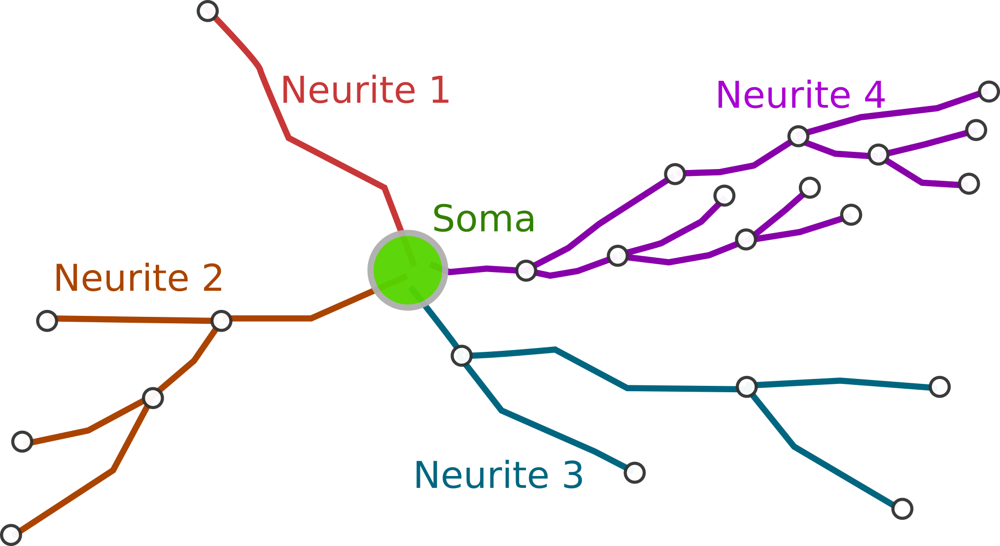
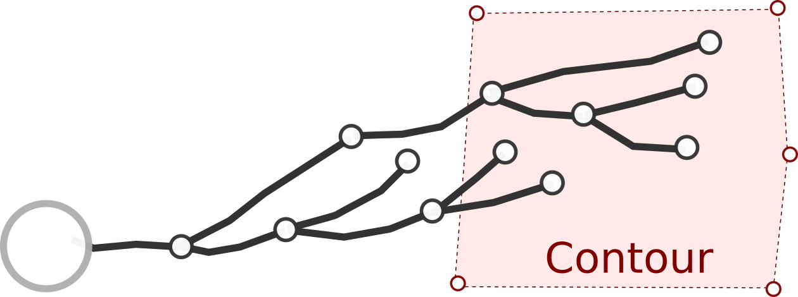

# Data model

This section describes the data model defined to represent the three-dimensional reconstruction of a set of neurons. The data model in NeuroSTR is a hierarchical model where each component is easily identifiable with their real neuroanatomy counterpart.

There are six core components in the data model, the foundation of the functionality in NeuroSTR:

- [Reconstruction](#reconstruction): A set of neurons and/or contours
- [Contour](#contour): A three-dimensional sequence of points that delimit a region
- [Neuron](#neuron): The main component. A three dimensional neuron
- [Neurite](#neurite): Each of the elements of a neuron. A common name for axon and dendrites in general.
- [Branch](#branch): The basic component of a neurite. A sequence of nodes.
- [Node](#node): The base component. A three dimensional point with diameter information.

---

### Node 

A Node in NeuroSTR is just a three-dimensional point with an associated radius/diameter. For convenience, you can see them as spheres in the three-dimensional space.

Additionally, we assign to each node an ID number, which identifies every node univocally. Input methods assign this ID automatically but, if you create a node, it's your responsibility to assign an unique ID to the new node.

Nodes usually appear as part of a [branch](#branch), but they can also appear as members of other structures, for example the [soma](#soma). Therefore, we usually refer to the branch that the nodes belong to as the node's parent branch, and we define the node's parent node as the previous node in the branch or neurite. The compartment between the node and it's parent is the node's compartment.

The first node in a neurite is called the **root** node of the neurite. A node with no descendants is a **terminal** node or terminal tip. Finally, a node with two or more descendants is a **bifurcation** node. The node itself and all its descendants are the **subtree** of the node. For implementation details (such as member data elements, functions, etc) please check the [Node class](classes/core/node.html) section.

---

### Branch 

We define the sequence of nodes and compartments between two bifurcation, terminal or root nodes. One node can only belong to one branch at the same time. To respect this one node - one branch restriction, the root node of the branch  is **not** considered part of it (although a copy of the node is stored in the branch for practical reasons). In the figure, all green nodes and compartments belong to the branch, whereas the root node in red does not.

Branches are always part of a single neurite. In the context of the neurite we can define for a single branch (red):
  - Parent branch (blue): The branch that contains the root node.
  - Sibling branch(es) (green): Other branches in the neurite that have the same root
  - Daughter branch(es) (purple): Branches that have the last node as their root.
  - Subtree (yellow): The given branch and all its descendants

The details about branch representation in NeuroSTR are available at the [class documentation](classes/core/branch.html)

---

### Neurite 

Neurites, also simply named "trees" in other tools, are the common name that we use to refer to dendrites, axons and apical dendrites. Neurites are just a tree of branches. Ideally, it should be a strict binary tree, that is, every branch has exactly zero or two daughter branches. There are four valid neurite types defined in the library: Undefined, Axon, Dendrite, Apical and Other.

The first branch of the neurite is called root branch. The root node of the root branch is the neurite root node. Usually, the root node is not considered part of the neurite but part of the neuron's soma.

Each neurite within a neuron should have an unique numeric ID, but the uniqueness it is not enforced. Although this ID might be sequential, the neurites in a neuron are not ordered.

There are two main ways to visit the branches of a neurite, which are implemented into two iterator types:

- The depth first iterator (DF) that visits the parent before their daughters
- The breadth first iterator (BF) that visits all the branches at the same centrifugal order before descending to the next order

---

### Neuron 

The neuron is probably the main element in our data model, but its definition is quite simple though. A neuron is defined by one or more nodes that describe its [cell body](#soma) and a set of neurite trees. It also has a string name or ID, that should identify the neuron univocally, although uniqueness is not enforced, and a special vector, called *UP* vector, for orientation purposes.

The neuron can contain any number of neurites (there is not any kind of size limit), but some logical restrictions apply, but once again, they are not enforced:

- The neuron can't have more than one apical dendrite
- The neuron can't have more than one axon dendrite

These and other "restrictions" to the neuron morphology can be verified through the [validation](validation.html) methods in the library

#### Soma 

The soma, i.e. the neuron cell body, representation is embedded within the neuron representation. In our library, the soma is just a sequence of [nodes](#node) that can describe the planar contour of the soma at certain depth, or its 3D shape as a set of spheres.

Please check [Neuron class](classes/core/neuron.html) documentation for implementation details.

---

### Contour 

A contour is a sequence of three dimensional points, usually in the same plane, that define the border of a region in the reconstruction. They are usually closed, but it is not mandatory. For example, the [cell body](#soma) is defined as a contour in Neurolucida files. A reconstruction can contain several contours.

In the vast majority of the cases, contours are not used for computing or measure anything. They are merely informative elements that can be drawn in a representation. However, in some cases they can be useful as they can define three-dimensional regions of interest (for example, cortical layers), and the end-user might be interested in selecting / measuring parts of the neuron inside/outside that region.

[Contour class](classes/core/contour.html) documentation.

---

### Reconstruction 

The reconstruction is the lat component in the data model. A reconstruction is simply a container class that accommodates several neurons and contours in a single element. The reason behind the definition of the reconstruction class is in the Neurolucida files: A single file can contain several neurons and contours, which are common to all neurons.

Since it is a simple container, the reconstruction has little functionality itself. For details check [Reconstruction class](classes/core/reconstruction.html) documentation.
